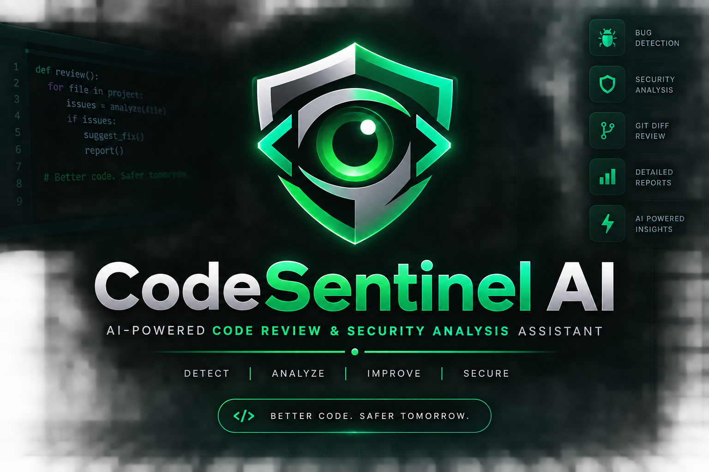
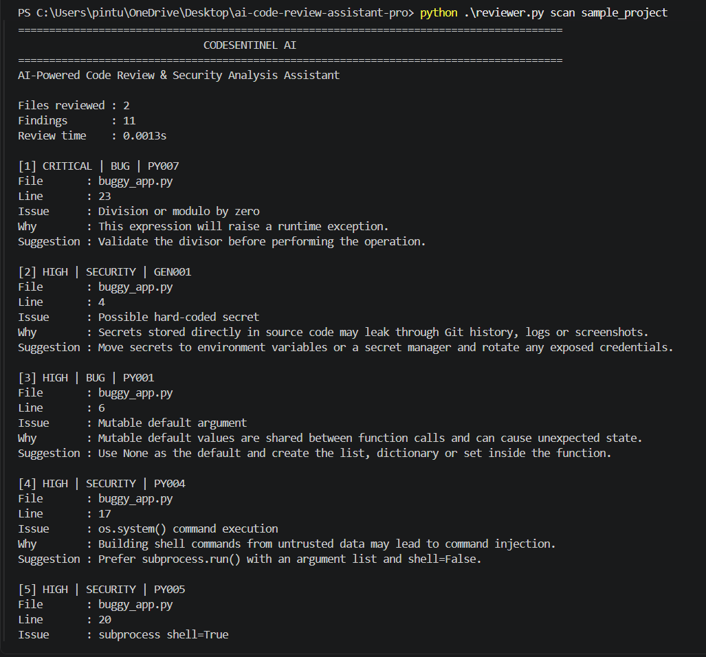
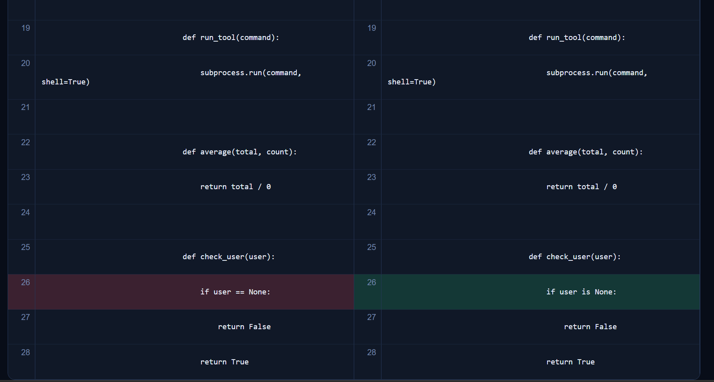
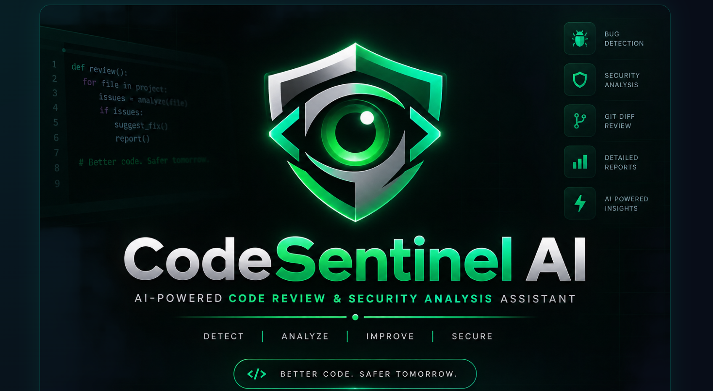
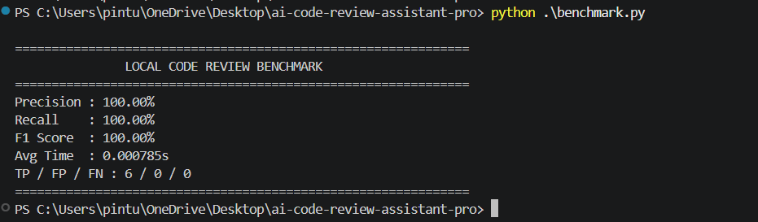
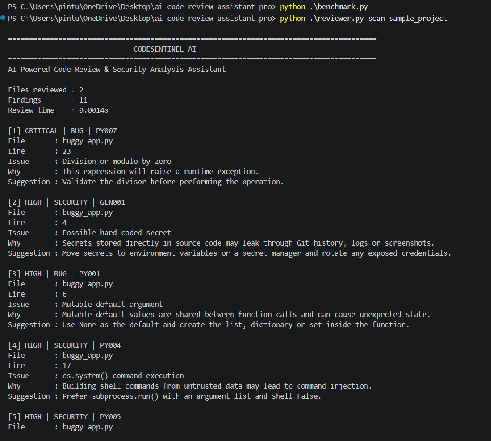
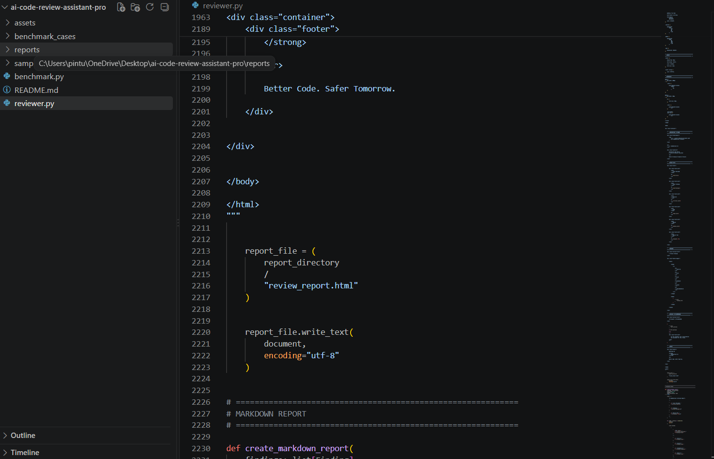

<div align="center">



<br>

# 🛡️ CodeSentinel AI

### Intelligent Code Review & Security Analysis Assistant

**Detect • Analyze • Improve • Secure**

<br>


<br>

**Python • JavaScript • TypeScript**

### Better Code. Safer Tomorrow.

</div>

---

# 🚀 What is CodeSentinel AI?

**CodeSentinel AI** is a code review and security analysis CLI tool designed to simulate a professional software-development code review workflow.

It scans source code and identifies supported:

- Programming bugs
- Security risks
- Reliability issues
- Maintainability problems
- Unsafe coding patterns
- Code-quality issues

For every detected issue, CodeSentinel AI provides:

- 📁 Exact file name
- 📍 Exact line number
- 🚨 Severity level
- 🏷️ Issue category
- 🧠 Explanation
- 💡 Recommended fix
- 📊 Professional review reports

The tool can scan an entire project or review only source files changed between Git revisions.

---

# 💼 Real-World Scenario

Imagine a software company where a senior developer gives a junior developer a task:

> **"Review this project before deployment. Identify bugs, security problems and risky code, and provide a professional review report."**

Instead of manually checking every source file, the developer can run:

```bash
python reviewer.py scan project_folder
```

CodeSentinel AI then performs the review.

```text
Senior Developer Assigns Project
            ↓
Developer Runs CodeSentinel AI
            ↓
Source Files Are Discovered
            ↓
Code & Security Rules Analyze Files
            ↓
File + Line-Level Findings Generated
            ↓
Recommended Fixes Are Displayed
            ↓
Professional Reports Are Generated
            ↓
Developer Reviews & Improves Code
```

---

# ✨ Key Features

| Feature | Description |
|---|---|
| 🐞 Bug Detection | Detects supported programming defects and runtime risks |
| 🛡️ Security Analysis | Identifies risky and potentially insecure patterns |
| 📁 Full Project Scan | Reviews an entire project directory |
| 📍 Line-Level Review | Reports exact file and line number |
| 🚦 Severity Analysis | Critical, High, Medium and Low |
| 🏷️ Issue Categories | Bug, Security, Reliability, Maintainability and Style |
| 💡 Fix Suggestions | Gives recommended improvements |
| 🔀 Git Diff Review | Reviews changed files between Git revisions |
| 🆚 Visual Diff | Shows Original vs Recommended code |
| 📄 HTML Reports | Professional browser-based report |
| 📝 Markdown Reports | GitHub-friendly review documentation |
| 🔧 JSON Reports | Structured output for automation |
| 📊 Benchmarking | Precision, Recall, F1 and review time |
| 💻 Multi-Language | Python, JavaScript and TypeScript |
| ⚡ Local Analysis | Static review works without external Python packages |

---

# 🧠 Supported Code Review Checks

## Python

Current Python checks include:

```text
Python Syntax Errors
Mutable Default Arguments
Bare except Blocks
eval() / exec()
os.system()
subprocess shell=True
Disabled TLS Verification
Literal Division by Zero
== None / != None
Possible Hard-Coded Secrets
Trailing Whitespace
```

Example:

```python
def add_user(name, users=[]):
    users.append(name)
    return users
```

Possible review:

```text
HIGH | BUG | PY001

File       : buggy_app.py
Line       : 6
Issue      : Mutable default argument

Why:
Mutable default values are shared between function calls
and can cause unexpected state.

Suggestion:
Use None as the default and create the list inside
the function.
```

---

## JavaScript / TypeScript

Current checks include:

```text
eval()
Direct innerHTML Assignment
Shell Command Execution
document.write()
Possible Hard-Coded Secrets
```

Example:

```javascript
document.getElementById("output").innerHTML = message;
```

Possible result:

```text
MEDIUM | SECURITY | JS002

Issue:
Direct innerHTML assignment

Why:
Untrusted HTML may create cross-site scripting risk.

Suggestion:
Prefer textContent or sanitize trusted HTML.
```

---

# 🚦 Severity Levels

| Severity | Meaning |
|---|---|
| 🔴 CRITICAL | Serious issue that may directly break execution or create major risk |
| 🟠 HIGH | Important security or correctness problem |
| 🟡 MEDIUM | Reliability or moderate security concern |
| 🔵 LOW | Maintainability, style or lower-risk issue |
| ⚪ INFO | Informational recommendation |

---

# ⚡ Quick Start

## Review the Included Sample Project

```bash
python reviewer.py scan sample_project
```

Example:

```text
========================================================================================
                              CODESENTINEL AI
========================================================================================

AI-Powered Code Review & Security Analysis Assistant

Files reviewed : 2
Findings       : 11
Review time    : 0.0020s
```

Each finding includes:

```text
Severity
Category
Rule
File
Line
Issue
Explanation
Suggestion
```

---

# 📁 Review Your Own Project

Example:

```bash
python reviewer.py scan my_project
```

Windows path example:

```powershell
python .\reviewer.py scan "C:\Users\pintu\Desktop\my-project"
```

CodeSentinel AI recursively scans supported source files.

---

# 🔀 Git Diff Review

CodeSentinel AI can review only files changed between Git revisions.

```bash
python reviewer.py review --base HEAD~1 --target HEAD
```

Workflow:

```text
Previous Commit
      ↓
Git Diff
      ↓
Changed Source Files
      ↓
CodeSentinel AI
      ↓
Review Findings
```

Useful before:

```text
Git Commit
Pull Request
Code Merge
Deployment
Release
```

---

# 📊 Professional Reports

Every successful project scan generates:

```text
reports/
├── review_report.html
├── review_report.md
└── review_report.json
```

---

## 🌐 HTML Report

The HTML report contains:

- CodeSentinel AI branding
- Files reviewed
- Total findings
- Critical issues
- High issues
- Medium issues
- Review time
- Detailed review findings
- Original vs Recommended code

Open on Windows:

```powershell
start .\reports\review_report.html
```

Linux:

```bash
xdg-open reports/review_report.html
```

macOS:

```bash
open reports/review_report.html
```

---

## 📝 Markdown Report

Generated file:

```text
reports/review_report.md
```

Useful for:

- GitHub documentation
- Code-review notes
- Portfolio evidence
- Technical documentation
- Pull request notes

---

## 🔧 JSON Report

Generated file:

```text
reports/review_report.json
```

Useful for future:

- Automation
- Dashboards
- CI/CD
- Analytics
- APIs
- Security tooling

---

# 🆚 Original vs Recommended

CodeSentinel AI can generate side-by-side safe code recommendations.

Example:

```text
ORIGINAL CODE                  RECOMMENDED CODE

if user == None:               if user is None:
    return False                   return False
```

The HTML report visually highlights:

```text
Original Code
      ↓
Detected Issue
      ↓
Recommended Code
```

Only supported low-risk transformations are displayed automatically.

Developers should manually review recommendations before applying changes to production code.

---

# 📊 Code Review Benchmark

CodeSentinel AI includes a small reproducible local benchmark.

Run:

```bash
python benchmark.py
```

Example:

```text
==============================================================
               LOCAL CODE REVIEW BENCHMARK
==============================================================

Precision : 100.00%
Recall    : 100.00%
F1 Score  : 100.00%
Avg Time  : 0.000693s
TP / FP / FN : 6 / 0 / 0

==============================================================
```

---

# 📈 Benchmark Metrics

| Metric | What it Measures | Why it Matters |
|---|---|---|
| F1 Score | Harmonic mean of Precision and Recall | Overall detection quality |
| Precision | Percentage of reported expected findings | Helps measure false alerts |
| Recall | Percentage of expected issues detected | Helps measure missed findings |
| Avg Time | Average review execution time | Performance |
| True Positive | Expected issue correctly detected | Correct detection |
| False Positive | Unexpected issue reported | False alert |
| False Negative | Expected issue not detected | Missed issue |

---

## ⚠️ Benchmark Disclaimer

The included benchmark measures only the **small labeled test cases bundled with this repository**.

A result such as:

```text
Precision : 100%
Recall    : 100%
F1 Score  : 100%
```

does **not** mean CodeSentinel AI has 100% accuracy on all real-world software projects.

The benchmark exists to demonstrate how code-review quality can be measured on reproducible test cases.

---

# 📸 CodeSentinel AI — Project Screenshots

## 1. CodeSentinel AI Review Overview

Overview of the working CodeSentinel AI project and review output.



---

## 2. Original vs Recommended Code

Professional side-by-side comparison showing original source code and recommended safer code.



---

## 3. Review Findings

Detailed findings showing:

- Severity
- File
- Line number
- Category
- Issue
- Recommendation



---

## 4. Local Code Review Benchmark

Benchmark displaying:

- Precision
- Recall
- F1 Score
- Average review time
- True Positive
- False Positive
- False Negative



> Benchmark values shown are based only on the bundled labeled test cases.

---

## 5. Terminal Code Review

Command-line demonstration showing CodeSentinel AI detecting code issues and generating review reports.



---

## 6. Project Source Code & Structure

VS Code project structure showing the main CodeSentinel AI source code, sample project, benchmark cases and reports.



---

# 📂 Project Structure

```text
pintu-codesentinel-ai/
│
├── assets/
│   └── codesentinel-banner.png
│
├── benchmark_cases/
│   ├── case_python.py
│   └── case_web.js
│
├── reports/
│   ├── review_report.html
│   ├── review_report.md
│   ├── review_report.json
│   └── benchmark.json
│
├── sample_project/
│   ├── buggy_app.py
│   └── unsafe_web.js
│
├── screenshots/
│
├── 01-terminal-review.png.png
├── 02-original-vs-recommended.png.png
├── 03-review-findings.png.png
├── 04-benchmark.png.png
├── 05-terminal-review.png.png
├── 06-project-code.png.png
│
├── benchmark.py
├── reviewer.py
└── README.md
```

---

# 🧪 Sample Project

The included sample files intentionally contain unsafe or buggy code for demonstration.

Example:

```python
def average(total, count):
    return total / 0
```

CodeSentinel AI can report:

```text
CRITICAL | BUG | PY007

Issue:
Division or modulo by zero

Why:
This expression will raise a runtime exception.

Suggestion:
Validate the divisor before performing the operation.
```

---

# 🔐 Security Analysis Example

Unsafe code:

```python
os.system("backup " + filename)
```

Possible finding:

```text
HIGH | SECURITY | PY004

Issue:
os.system() command execution

Why:
Building shell commands from untrusted data may
lead to command injection.

Suggestion:
Prefer subprocess.run() with an argument list
and shell=False.
```

---

# 🔑 Hard-Coded Secret Detection

Example:

```python
API_KEY = "demo-secret-key-123456"
```

Possible finding:

```text
HIGH | SECURITY | GEN001

Issue:
Possible hard-coded secret

Suggestion:
Move secrets to environment variables or
a secret manager.
```

> All secrets included in the sample project are fake demonstration values.

---

# 💻 Supported Languages

| Language | Status |
|---|---|
| Python | ✅ Supported |
| JavaScript | ✅ Supported |
| TypeScript | ✅ Supported |
| JSX | ✅ Supported |
| TSX | ✅ Supported |
| Java | 🔜 Planned |
| Go | 🔜 Planned |
| C / C++ | 🔜 Planned |

---

# 🖥️ Supported Platforms

| Platform | Status |
|---|---|
| Windows | ✅ Supported |
| Linux | ✅ Supported |
| macOS | ✅ Supported |

---

# 🛠️ Technologies Used

```text
Python
Python AST
Regular Expressions
Git
Git Diff
HTML
CSS
JSON
Markdown
CLI Development
Static Code Analysis
Security Analysis
Benchmarking
```

---

# 🧩 How CodeSentinel AI Works

```text
               ┌─────────────────────────┐
               │     Source Project      │
               └────────────┬────────────┘
                            │
                            ▼
               ┌─────────────────────────┐
               │     File Discovery      │
               │ Python / JS / TS / JSX │
               └────────────┬────────────┘
                            │
                            ▼
               ┌─────────────────────────┐
               │     Static Analysis     │
               │      AST + Rules        │
               └────────────┬────────────┘
                            │
                            ▼
               ┌─────────────────────────┐
               │   Security Analysis     │
               │    Risky Patterns       │
               └────────────┬────────────┘
                            │
                            ▼
               ┌─────────────────────────┐
               │     Finding Engine      │
               │ File + Line + Severity  │
               └────────────┬────────────┘
                            │
                            ▼
        ┌────────────────────────────────────────┐
        │ HTML | Markdown | JSON Review Reports │
        └────────────────────────────────────────┘
```

---

# 🎯 Learning Outcomes

This project demonstrates practical knowledge of:

- Python Programming
- Static Code Analysis
- Abstract Syntax Trees
- Security Analysis
- Git Workflow
- Software Debugging
- Code Review
- Report Generation
- Benchmarking
- CLI Application Development
- Defensive Programming
- GitHub Documentation

---

# 🚀 Future Improvements

Planned improvements include:

```text
AI-Assisted Deep Code Review
More Programming Languages
Pull Request Integration
GitHub Actions
CI/CD Integration
Automatic Safe Fix Application
Custom Rules
Rule Enable / Disable Options
Interactive Dashboard
SARIF Reports
PDF Reports
Repository-Level Context
Advanced Security Rules
Test Execution
Review History
Team Dashboard
```

---

# 🤖 AI Integration Roadmap

The current version primarily uses deterministic static-analysis rules.

A future AI-assisted review layer may help analyze:

- Business logic
- Complex code context
- Cross-file relationships
- Maintainability
- Architecture
- Developer intent
- Advanced bug patterns

This allows the current version to remain reproducible while leaving room for deeper AI-assisted analysis.

---

# ⚖️ Important Limitations

CodeSentinel AI is a **code review assistant**.

It does not guarantee that:

- Every possible software bug will be found
- Every security vulnerability will be detected
- Every recommendation will be appropriate for every project
- Reviewed code is automatically secure
- All business-logic defects can be detected

Developers should manually verify findings before changing production code.

---

# 🔒 Security & Ethics

CodeSentinel AI is designed for:

- Software development
- Defensive security
- Educational labs
- Authorized code review
- Personal projects
- Company projects you have permission to review

Do not send confidential source code to external services without authorization.

---

# 🗺️ Project Roadmap

```text
✅ Full Project Scan
✅ Python Review
✅ JavaScript Review
✅ TypeScript Review
✅ File + Line Findings
✅ Severity Analysis
✅ Security Analysis
✅ Git Diff Review
✅ HTML Reports
✅ Markdown Reports
✅ JSON Reports
✅ Original vs Recommended Diff
✅ Local Benchmark

🔜 AI-Assisted Review
🔜 GitHub Actions
🔜 Pull Request Comments
🔜 Additional Languages
🔜 Safe Automatic Fixes
🔜 Dashboard
🔜 SARIF Support
```

---

# 📌 Why I Built CodeSentinel AI

Modern development teams review code before merging and deploying software.

I created CodeSentinel AI to learn and demonstrate:

- How code-review tools analyze source code
- How bugs can be detected programmatically
- How security rules identify risky code
- How Git-based review workflows work
- How professional reports are generated
- How review quality can be benchmarked

This project is part of my practical learning journey in **Python, Cyber Security and Software Development**.

---

# 👨‍💻 Author

## Pintu Aryan

**Aspiring Cyber Security Analyst**

Networking | Python | Security Operations

### GitHub

```text
https://github.com/pintuaryan8973-source
```

---

<div align="center">

# 🛡️ CodeSentinel AI

### Detect • Analyze • Improve • Secure

## Better Code. Safer Tomorrow.

⭐ If you find this project useful, consider starring the repository.

</div>
